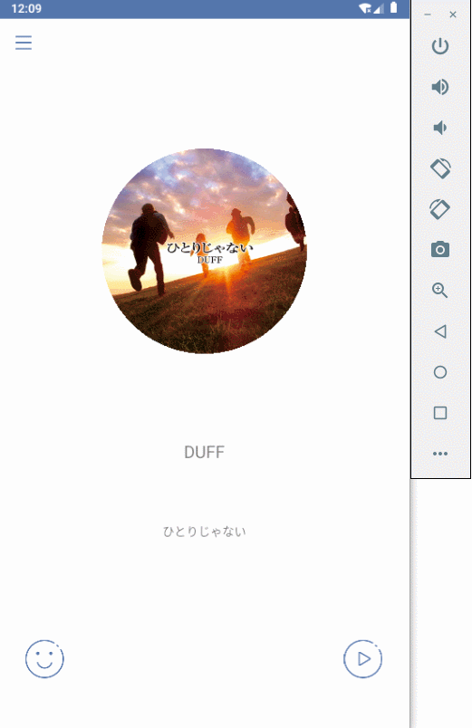

# 2019红岩移动开发部Android方向半期考核

由于时间不够 然后又很菜 写的东西不是很多 

主要就写了播放器的部分 写出来的部分还有挺多的bug 希望之后有空可以慢慢改过来这些bug

## 软件截图

|播放 暂停 上一首 下一首 进度拖拽|欢迎界面 日推界面|
|---|---|
|||

## 安装包

屏幕适配做的很差 就打包两个安装包分别给[相对偏大一些](https://github.com/Gennan/AndroidHalfExamAssessment/blob/master/Elf/release/elf_large.apk)和[相对偏小一些](https://github.com/Gennan/AndroidHalfExamAssessment/blob/master/Elf/release/elf_small.apk)的屏幕的使用
